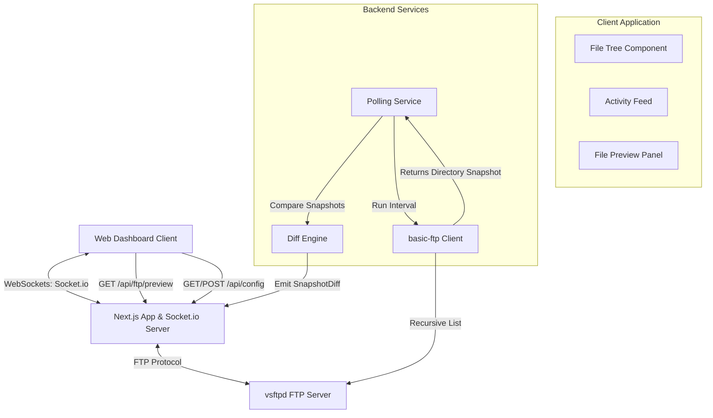
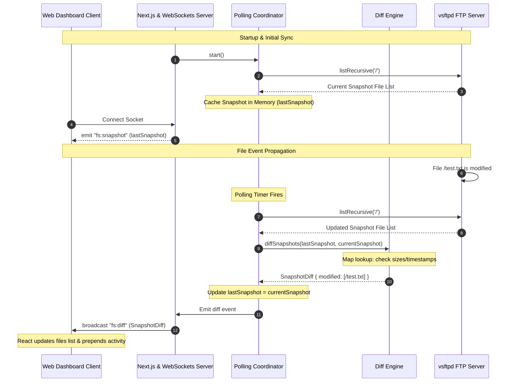

# FTP Stream Monitor (Real-Time State Synchronization)

A real-time, event-driven system monitoring application that wraps a stateless FTP server, detects filesystem modifications using an in-memory diffing engine, and streams live updates to connected browser dashboards using WebSockets.

---

## 🚀 Overview

This project implements a highly auditable and low-latency system monitor where:
-   **FTP File State** is evaluated dynamically via recursive directory listing.
-   **State Differences (Diffs)** are calculated in memory to bypass database write bottlenecks.
-   **Symmetric Diffing** detects additions, modifications, and deletions in linear O(N) time.
-   **WebSockets (Socket.io)** broadcast incremental patches to all client web UIs.

---

## 🏗️ High-Level Architecture & Flow

The system consists of three primary tiers: the web client dashboard, the Next.js server containing the active polling loop and diffing engine, and the remote vsftpd server instance.



---

## ⚡ Real-Time Sync Lifecycle

Below is the chronological sequence of events showing how the initial state is established and how a file modification propagates from the FTP filesystem to the active browser dashboards.



---

## 🧠 Why In-Memory Diffing? (Database vs. In-Memory State)

In standard file synchronization systems, state tracking often relies on persisting file listings to a database and running heavy SQL joins to identify modified items.

*   **The Database Join Bottleneck:** Storing thousands of file paths and metadata columns in a database requires frequent read/write transactions. At high polling frequencies, database write locks and index rebuilds degrade throughput and increase system latency.
*   **The In-Memory Solution:** By maintaining the last-known state as an active memory snapshot, the application bypasses database disk I/O entirely. The diff is calculated in memory using linear hash-map lookups. This reduces state reconciliation times to sub-millisecond ranges and enables highly responsive, real-time dashboards.

---

## 🌍 Real-World Use Cases

The architectural design of this project is directly applicable to several enterprise-level systems:
1. **Automated Document Ingestion:** Monitors remote dropboxes where third parties upload invoices, reports, or legal logs, triggering automated ingestion scripts immediately.
2. **Audit Logging & Directory Monitoring:** Tracks unauthorized or unexpected file creations, modifications, and deletions in secure storage arrays.
3. **Backup Synchronization Agents:** Serves as the blueprint for background agents (like Dropbox or OneDrive) that track local/remote file changes and resolve conflict states.

---

## 🛡️ Strategic Architectural Advantages

By combining an in-memory diffing engine with WebSockets, this system achieves operational capabilities that are highly resilient:

*   **Event-Driven WebSocket Streaming:** Instead of having multiple web clients polling the backend, clients establish a single TCP socket connection. The server pushes updates *only* when a diff is generated, saving network bandwidth.
*   **Stateless Backend Recovery:** The backend does not maintain persistent state. If the server crashes, it runs a full FTP directory scan on startup to rebuild its in-memory snapshot, ensuring perfect recovery without database migrations.
*   **Decoupled Architecture:** The Next.js dashboard UI, custom WebSocket server, and FTP file server are decoupled, allowing each tier to scale independently in production.

---

## 📂 Project Structure

```
FtpStreamMonitor/
├── docker-compose.yml        # App & FTP services orchestration
├── Dockerfile                # Production multi-stage build
├── server.ts                 # Custom HTTP + Socket.io server
├── tests/
│   └── diff-engine.test.ts   # Jest unit tests for diffing scenarios
└── src/
    ├── app/                  # Next.js pages & routes
    ├── components/           # Explorer, Preview, Feed components
    └── lib/                  # Polling & FTP client utilities
```

---

## 🚀 Getting Started

### 1. Configure Environment
Create a `.env` file at the root of the repository:
```bash
FTP_USER=testuser
FTP_PASS=testpass
FTP_HOST=ftp
NEXT_PUBLIC_WS_URL=ws://localhost:3000
POLLING_INTERVAL_MS=5000
```

### 2. Launch the Application Stack
Build and start all services using Docker Compose:
```bash
docker-compose up -d --build
```
This boots:
- The `app` service (Next.js Dashboard on port 3000)
- The `ftp` service (vsftpd server on ports 21 and passive range)

### 3. Run Unit Tests
To run the diffing engine tests locally:
```bash
npm install
npm test
```
